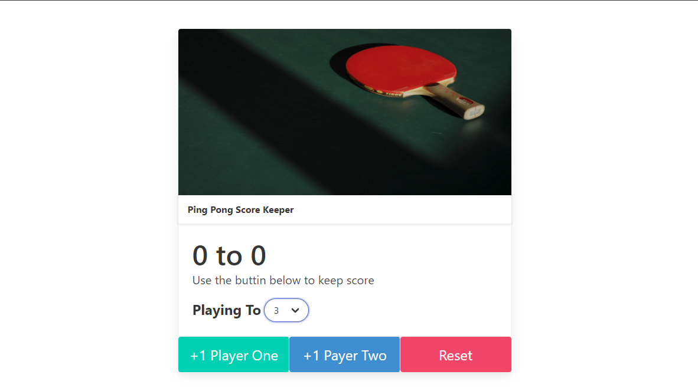

# Score-Keeper
I made a score keeper app with HTML CSS BULMA and JAVSCRIPT

### Screenshot

### Links

- Solution URL: [https://github.com/Teke111/Score-Keeper]
- Live Site URL: [https://teke111.github.io/Score-Keeper/]

## My process

### Built with

- Semantic HTML5 markup
- CSS custom properties
- Bulma
- Javascript

